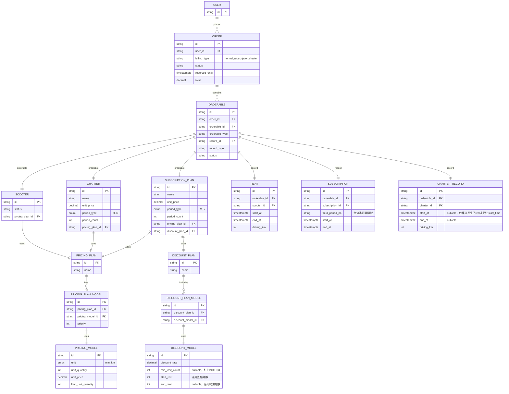

# Vehicle Rental API

[](https://github.com/wicogohome/vehicle-rental-api/actions/workflows/test.yml)

| Catagory     |          |
| ------------ | -------- |
| Famework     | Nest.js  |
| Database     | Postgres |
| ORM          | TypeORM  |
| Container    | Docker   |
| Unit test    | Jest     |
| API document | Swagger  |

## Overview

Vehicle Rental API是一個提供車輛租借API的Nest.js專案，可透過API讓指定使用者對指定車輛進行租借與歸還。

以下API用於租車與環車：

1. Rent
    1. 建立 Rent（租車）
    2. 更新 Rent的end_at（還車）
    3. 列出所有 Rent

另有用於測試的API：

1. User
    1. 建立Fake User
    2. 列出所有 User
2. Scooter
    1. 建立Fake Scooter
    2. 列出所有 Scooter

※API詳細內容請先[安裝](#Installation)後查看`http://localhost/api-doc/`

### 當前程式流程


### 對於完整的租借情境，則有以下規劃（未實作）:


## Installation

※請確保同時 沒有其他使用localhost:80 的服務

```shell
$ git clone git@github.com:wicogohome/vehicle-rental-api.git

$ cd vehicle-rental-api

$ cp .env .env.local && cp .env.production .env.production.local

# (填寫env參數 POSTGRES_USER & POSTGRES_PASSWORD)

# 後續可直接用以下指令開啟docker compose
$ docker compose up

```

完成後即可對localhost:80施打，詳細請見`http://localhost/api-doc/`  
※需要先自己處理資料庫初始化

## Tables

### users

| column          | type                 | comment          |
| --------------- | -------------------- | ---------------- |
| id              | uuid                 | primary key      |
| national_ID_No  | charcter varying(10) | 身分證字號或護照 |
| driving_license | charcter varying(10) | 駕照或國際駕照   |

#### memo

-   有外國人

### scooters

| column        | type                 | comment      |
| ------------- | -------------------- | ------------ |
| id            | uuid                 | primary key  |
| license_plate | charcter varying(10) | 車牌號碼     |
| VIN           | charcter varying(17) | 車輛識別號碼 |
| is_available  | boolean              | 是否可被租借 |
| version       | int                  | 用於上樂觀鎖 |

#### memo

-   電量(可用公里數)
-   位置
-   紅標優惠車輛

### rents

| column        | type         | comment                        |
| ------------- | ------------ | ------------------------------ |
| user_id       | uuid         | foreign key                    |
| rentable_type | string       | 基本上是scooter，但有car等種類 |
| rentable_id   | string       |                                |
| start_at      | timestamp_tz |                                |
| end_at        | timestamp_tz | nullable                       |

#### memo

-   有單日收費上限(4320)，就是一般計價的24小時
-   有預定功能（10分）
-   時間計算以秒進位，例如：實際租用時間為9分01秒，則以10分鐘計價。
-   總金額以無條件進位。

## Checklist

-   [x] POST 租借車輛，User租借Scooter，並有條件限制：
    -   [x] 同一個人同時間只能租借一台車，一台車同時也只能被一個人使用。
-   [x] POST 歸還車輛，幫指定Rent加上end_at
-   [x] GET 查看租借紀錄Rent（list）
-   [x] 測試
-   [x] 高併發處理 & transaction
-   [x] 文件
-   [x] API resonse format

## 延伸 - ERD

為滿足可能的租借機車/訂閱方案/包車等需求，規劃了以下ERD：



### 情境 1：使用者對指定機車進行預訂，未租借則訂單取消

-   `ORDER` 記錄預訂資訊，`reserved_until` 表示取消的截止時間。
-   當時間超過 `reserved_until` 且 `ORDERABLE.status` = 'pending'，則設置 `ORDER.status` = 'canceled'。

### 情境 2：一般費率計價

-   當` ORDER.billing_type` = 'normal' 且 `ORDERABLE` 生成 `RENT` 記錄時，按 `PRICING_PLAN` 和 `PRICING_MODEL` 的 `priority` 順序進行計價：
    -   前 6 分鐘使用固定費率:　一個單位為六分鐘，每一單位18元，只適用一單位
        -   unit_price = 18
        -   unit_quantity = 6
        -   unit = min
        -   limit_unit_quantity = 1
    -   之後每分鐘計價：　一個單位為一分鐘，每一單位3元，不限制適用單位數
        -   unit_price = 3
        -   unit_quantity = 1
        -   unit = min
        -   limit_unit_quantity = null

### 情境 3：訂閱的計價與折扣

-   當 `ORDER.billing_type` = 'subscription'：
    -   每趟優惠費率
        -   使用 `SUBSCRIPTION_PLAN` 的`PRICING_PLAN`和 `PRICING_MODEL`，定義前三分鐘免費。
            -   unit_price = 0
            -   unit_quantity = 3
            -   unit = min
            -   limit_unit_quantity = 1
        -   之後按 `SCOOTER` 的 `PRICING_PLAN` 一般費率計價。
    -   訂單打折：
        -   使用 `DISCOUNT_PLAN` 和 `DISCOUNT_MODEL` 設定打折規則，將 `DISCOUNT_MODEL.discount_rate` 應用於 `ORDER` 最終價格。
        -   前三趟20min免費
            -   discount_rate = 0
            -   min_limit_count = 20
            -   start_rent = 1
            -   end_rent = 3
        -   第五趟開始打折
            -   discount_rate = 0.95
            -   min_limit_count = null
            -   start_rent = 5
            -   end_rent = 9

### 情境 4：包車的加收計費

-   當 `ORDER.billing_type` = 'charter'：
    -   根據 `CHARTER`的`PRICING_PLAN` & `PRICING_MODEL` 確定免費里程與加收費率。
        -   免費15KM
            -   unit_price = 0
            -   unit_quantity = 15
            -   unit = KM
            -   limit_unit_quantity = 1
        -   超出部分：(priority設定相同)
            -   每分鐘加收3元：
                -   unit_price = 3
                -   unit_quantity = 1
                -   unit = min
                -   limit_unit_quantity = null
            -   每公里加收3.5元：
                -   unit_price = 3.5
                -   unit_quantity = 1
                -   unit = KM
                -   limit_unit_quantity = null
